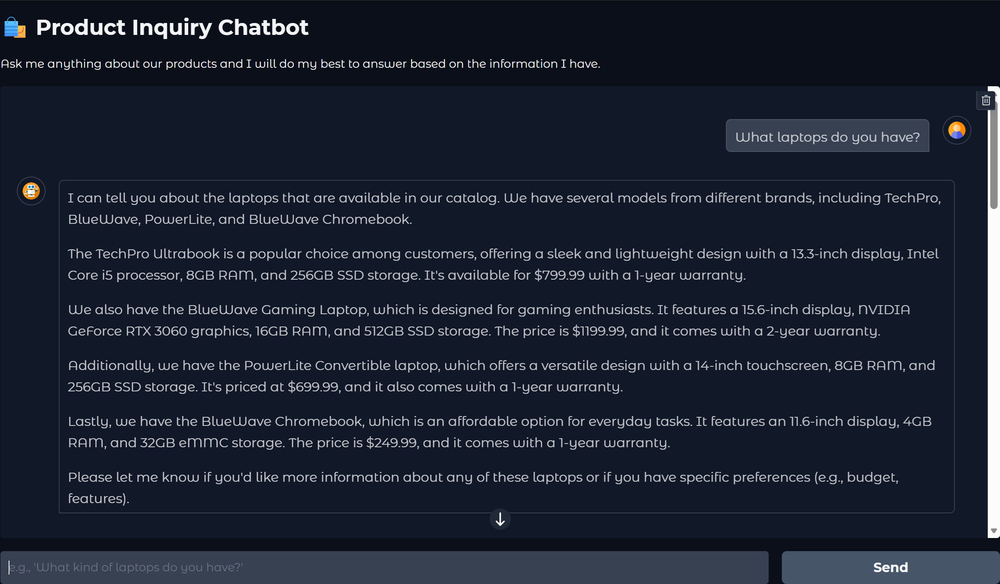
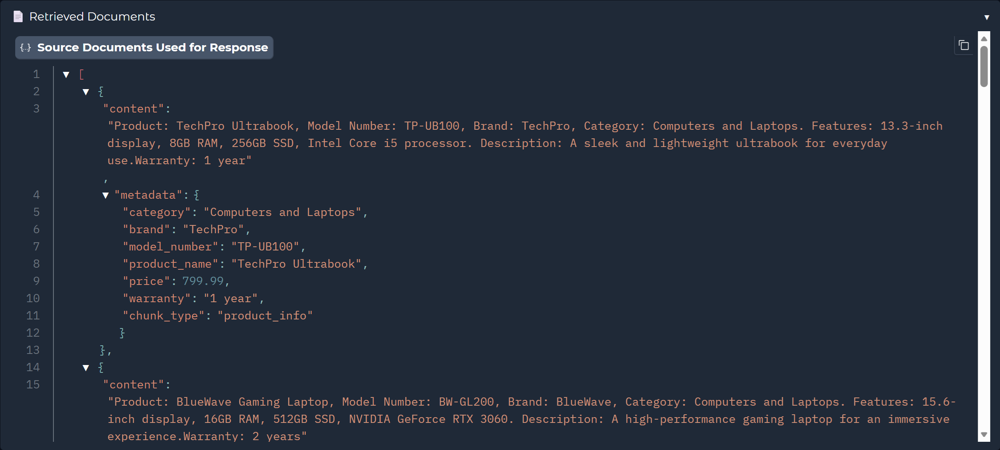

# 🛍️ Product Inquiry Chatbot

This project is a local-first RAG (Retrieval-Augmented Generation) chatbot designed to answer questions about a product catalog and reviews. It leverages local language models via Ollama, ensuring privacy and offline capability.

The chatbot provides a user-friendly web interface built with Gradio, where users can ask questions in natural language. The system intelligently retrieves relevant product information and customer reviews to generate accurate and context-aware answers.


*The user interface, showing the chat history.*

## ✨ Key Features

- **Local & Private**: All models and data run on your local machine. No data ever leaves your computer.
- **Retrieval-Augmented Generation (RAG)**: The chatbot doesn't rely solely on its pre-trained knowledge. It searches a vector database of product specifications and customer reviews to find the most relevant information before answering a query.
- **Intelligent Query Handling**:
    - **Query Moderation**: Input queries are first checked for safety using a local guard model.
    - **Contextual Rewriting**: Follow-up questions are automatically rewritten to be self-contained, improving retrieval accuracy (e.g., "Tell me about its warranty" becomes "What is the warranty for the TechPro Ultrabook?").
    - **Smart Filtering**: The system can extract filters from your query, like price ranges, brands, and categories, to narrow down the search.
- **Transparent & Debuggable**: The Gradio interface includes an accordion that shows the exact documents the chatbot used to generate its response. This is great for testing and understanding the retrieval process.

*The user interface, showing the the retrieved documents used for generation.*


## 🚀 Getting Started

Follow these steps to get the chatbot running on your local machine.

### 1. Prerequisites: Install Ollama and Models

This project relies on local LLMs served by [Ollama](https://ollama.com/).

1.  **Install Ollama**: Follow the instructions on the Ollama website to download and install it for your operating system.
2.  **Download the Required Models**: Run the following commands in your terminal to pull the necessary models. The `llama3.2` model is for generation and rewriting, and `llama-guard3` is for moderation.

    ```bash
    ollama pull llama3.2
    ollama pull llama-guard3
    ```

    For a detailed guide on running LLMs locally with Ollama, check out this blog post:
    [**Running LLMs Locally: A Hands-On Guide with Ollama**](https://blogs-amoydutta.hashnode.dev/running-llms-locally-a-hands-on-guide-with-ollama)

### 2. Set Up the Project

1.  **Clone the Repository (if you haven't already)**:
    ```bash
    git clone <repository-url>
    cd <repository-directory>
    ```
2.  **Create a Virtual Environment**:
    ```bash
    python -m venv venv
    source venv/bin/activate  # On Windows, use `venv\Scripts\activate`
    ```
3.  **Install Python Dependencies**:
    ```bash
    pip install -r requirements.txt
    ```

### 3. Prepare the Data and Vector Database

Before you can run the chatbot, you need to process the product data and populate the vector database. This data is available 
in json format in the `products.json` and `product_reviews.json` files. 

1.  **Precompute Filterable Metadata**: This script creates a file with all available brands and categories, which helps with search filtering.
    ```bash
    python metadata_precomputation.py
    ```
2.  **Run the ETL Pipeline**: This is the most important step. This script reads the product and review JSON files, generates embeddings for them, and loads them into the ChromaDB vector database.
    ```bash
    python vector_db_manager.py
    ```

### 4. Run the Chatbot

Once the database is populated, you can start the Gradio web application.

```bash
python chatbot_app.py
```

Open your web browser and navigate to **http://127.0.0.1:7860** to start chatting!

## 🧪 Testing Scripts

The `test_scripts/` directory contains several Python scripts to test different parts of the RAG pipeline.

-   `test_chatbot_responses.py`: Automates testing of chatbot responses against a set of predefined questions.
-   `test_chunking.py`: Tests the document chunking strategies defined in `document_processor.py`.
-   `test_retrieval_evaluation.py`: Evaluates the performance of the retrieval system based on user queries.
-   `test_splitting.py`: A script for testing different text splitting methods.
-   `test_vector_db_population.py`: Tests the population of the vector database.

## 📂 Project Structure & Key Files

Here is a breakdown of the most important files in the project:

-   `chatbot_app.py`: The main entry point for the application. It contains the Gradio UI code and orchestrates the entire query-response pipeline.
-   `llm_interface.py`: Handles all communication with the Ollama-served language models, including query moderation, rewriting, and final response generation.
-   `retrieval_manager.py`: The core of the retrieval system. It takes a rewritten query, extracts filters, routes the query to the correct data collections, and performs the semantic search in ChromaDB.
-   `vector_db_manager.py`: A utility script that manages the ETL (Extract, Transform, Load) process. It prepares the data and populates the ChromaDB vector store.
-   `document_processor.py`: Contains functions for loading, processing, and chunking source documents (from JSON files) before they are added to the vector database.
-   `metadata_precomputation.py`: A helper script that runs once to extract all unique brands and categories from the product data, which are then used for filtering in `retrieval_manager.py`.
-   `products.json` & `product_reviews.json`: The raw data sources for the chatbot's knowledge base.
-   `filterable_metadata.json`: An auto-generated file containing lists of all unique brands and categories, used to aid the retrieval process.
-   `test_user_queries.md`: A markdown file containing a list of queries to test the chatbot's performance.
-   `docs/`: Contains additional documentation, such as text files used for testing document processing.
-   `static/`: Contains static assets for the Gradio UI, like user and bot avatar images.


# Potential Improvements for Future
1. Fine tuning of metadata filters
2. Better routing logic rather than the simple deterministic one we have at the moment
3. Better context-awareness
4. Better extraction of categories and products from user query (either LLM-based or stemming to handle plurals)
