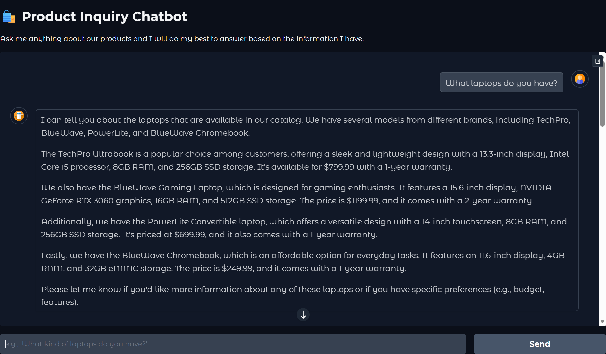
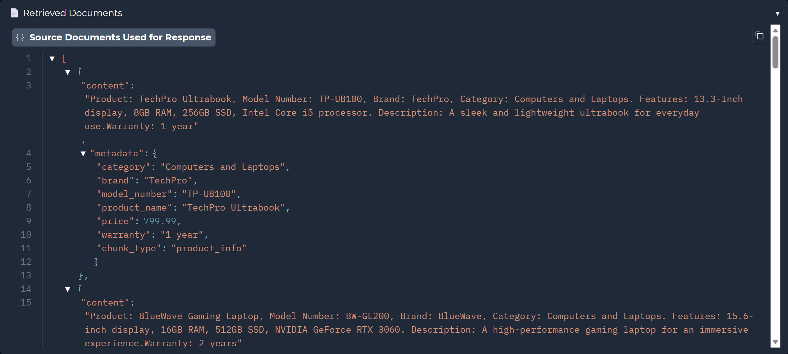

# 🛍️ Product Inquiry Chatbot (Hugging Face Spaces Version)

This project is a RAG (Retrieval-Augmented Generation) chatbot designed to answer questions about a product catalog and reviews, deployed on Hugging Face Spaces. It leverages the Hugging Face Inference API to power its language model capabilities.

The chatbot provides a user-friendly web interface where users can ask questions in natural language. The system intelligently retrieves relevant product information and customer reviews to generate accurate and context-aware answers.

IMPORTANT: The gradio-spaces-version branch is finetuned to be publishable on Hugging Faces Spaces while the 
main branch has code that works locally Ollama - hence, it has a different set of instructions. 

*The user interface, showing the chat history.*

## ✨ Key Features

- **Cloud-Based RAG**: The chatbot uses a Retrieval-Augmented Generation architecture. It searches a pre-built vector database of product specifications and customer reviews to find the most relevant information before answering a query.
- **Hugging Face Powered**: All LLM interactions (moderation, query rewriting, and response generation) are handled by models hosted on the Hugging Face Inference API.
- **Intelligent Query Handling**:
    - **Query Moderation**: Input queries are checked for safety using a moderation model (`Qwen/Qwen2.5-7B-Instruct`).
    - **Contextual Rewriting**: Follow-up questions are automatically rewritten to be self-contained, improving retrieval accuracy (e.g., "Tell me about its warranty" becomes "What is the warranty for the TechPro Ultrabook?").
- **Transparent & Debuggable**: The interface includes an accordion that shows the exact documents the chatbot used to generate its response, which is useful for understanding the retrieval process.

*The user interface, showing the the retrieved documents used for generation.*

## 🚀 Getting Started

The application is hosted on Hugging Face Spaces. You can access it directly via your web browser.

**➡️ Live Demo: [Link to your Hugging Face Space]**

No local installation is required. The vector database is pre-built and included in the repository, and all language models are accessed via remote API.

## 🧪 Testing Scripts

The `test_scripts/` directory contains several Python scripts to test different parts of the RAG pipeline locally (requires cloning the repository and setting up a local environment).

-   `test_chatbot_responses.py`: Automates testing of chatbot responses against a set of predefined questions.
-   `test_chunking.py`: Tests the document chunking strategies defined in `document_processor.py`.
-   `test_retrieval_evaluation.py`: Evaluates the performance of the retrieval system based on user queries.
-   `test_splitting.py`: A script for testing different text splitting methods.
-   `test_vector_db_population.py`: Tests the population of the vector database.

## 📂 Project Structure & Key Files

Here is a breakdown of the most important files in the project:

-   `app.py`: The main entry point for the Hugging Face Spaces deployment. It imports and launches the Gradio application.
-   `chatbot_app.py`: Contains the Gradio UI code and orchestrates the entire query-response pipeline, from receiving user input to displaying the final answer.
-   `llm_interface.py`: Handles all communication with the Hugging Face Inference API. It is responsible for query moderation, rewriting, and final response generation using serverless models like `meta-llama/Llama-3.2-3B-Instruct` and `Qwen/Qwen2.5-7B-Instruct`.
-   `retrieval_manager.py`: The core of the retrieval system. It takes a rewritten query, performs a semantic search in the pre-built ChromaDB database, and returns the most relevant documents.
-   `vector_db_manager.py`: A utility script used to create the vector database from source JSON files. In the deployed version, this script is pre-run, and the database is included in the repository.
-   `document_processor.py`: Contains functions for loading, processing, and chunking source documents (from JSON files) before they are added to the vector database.
-   `products.json` & `product_reviews.json`: The raw data sources for the chatbot's knowledge base.
-   `chroma_db/`: The pre-built vector database containing embeddings for all products and reviews.
-   `static/`: Contains static assets for the Gradio UI, like user and bot avatar images.

# Potential Improvements for Future
1. Fine tuning of metadata filters
2. Better routing logic rather than the simple deterministic one we have at the moment
3. Better context-awareness
4. Better extraction of categories and products from user query (either LLM-based or stemming to handle plurals)
